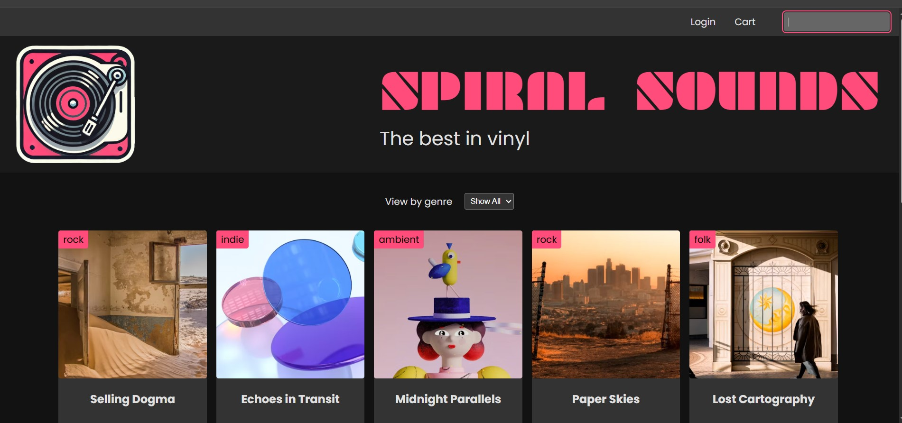
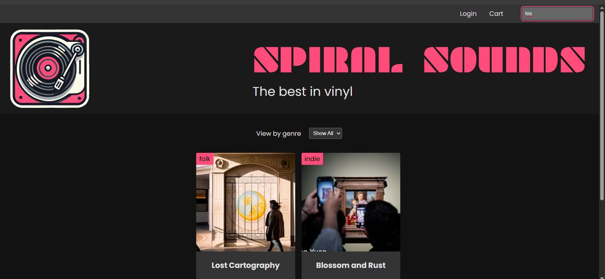
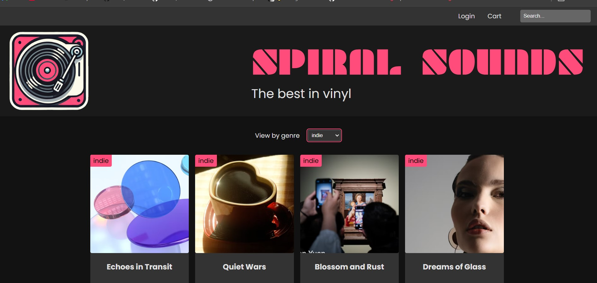
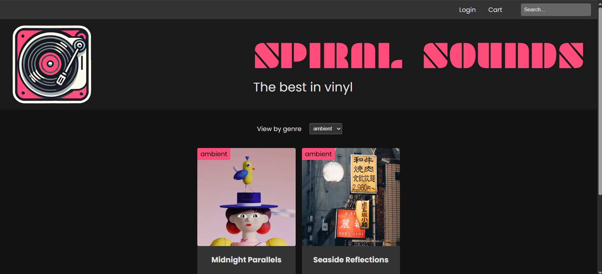
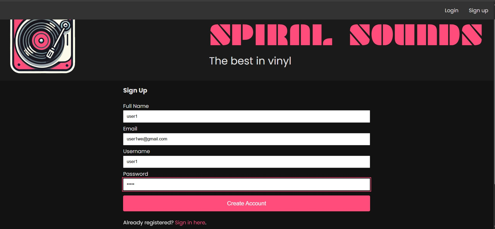
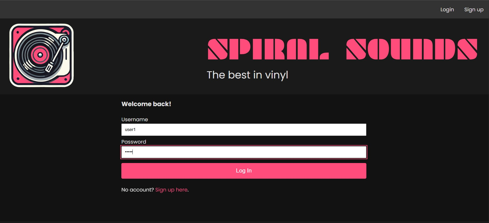
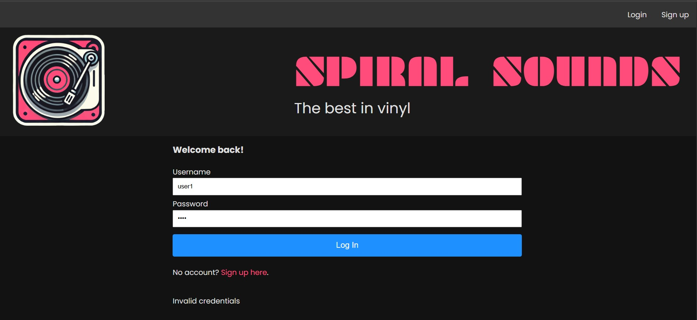
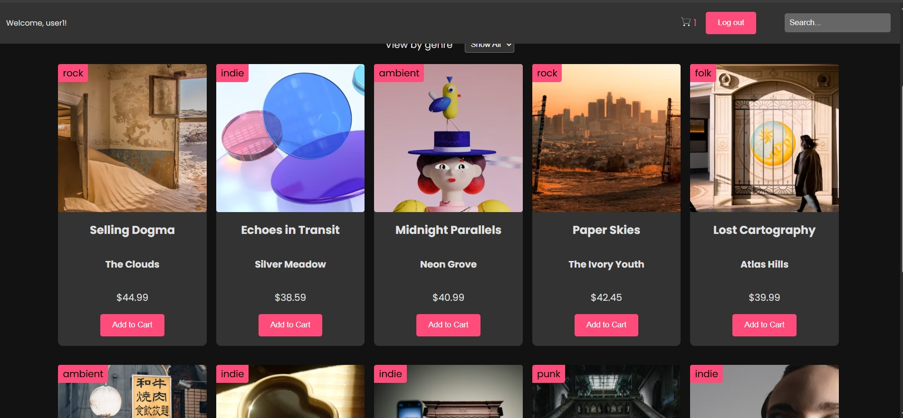
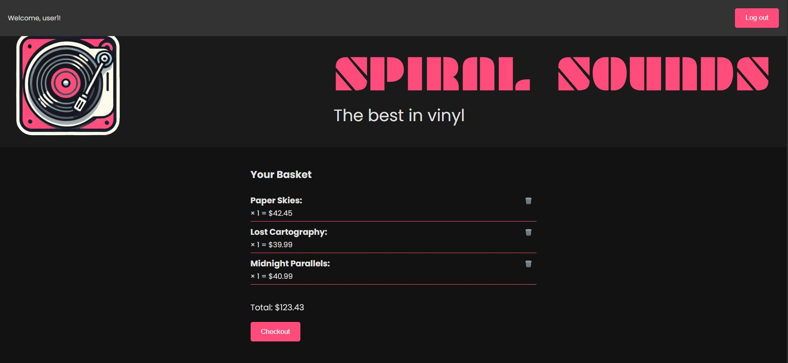
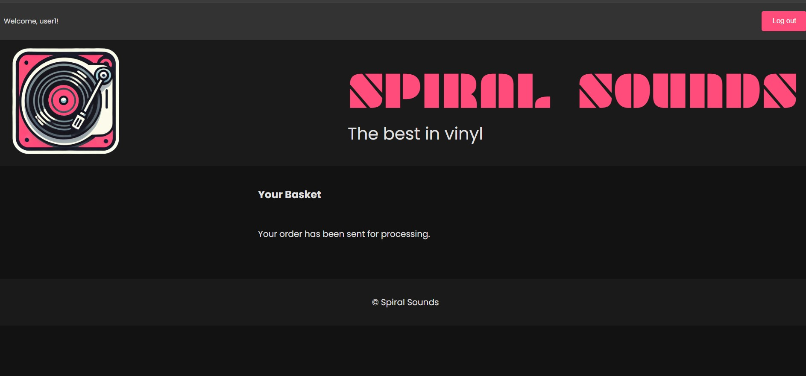

# Spiral Sounds – Full-Stack E-Commerce Platform

Spiral Sounds is a responsive, full-stack web application designed for browsing, searching, and purchasing vinyl records. Built with **Express.js** and **vanilla JavaScript**, this project demonstrates a complete end-to-end e-commerce flow, featuring persistent user authentication, session management, and a fully deployed cloud database architecture.

## 🚀 Live Demo

**[Insert Your Render URL Here]**

> **Note:** The backend is hosted on a free Render tier. If the server has been inactive, please allow 30–50 seconds for the initial load as the instance wakes up. Subsequent requests will be extremely fast!

## 🛠 Tech Stack

- **Frontend:** HTML, CSS, Vanilla JavaScript
- **Backend:** Node.js, Express.js
- **Database:** MongoDB Atlas (Cloud)
- **ODM:** Mongoose
- **Authentication & State:** express-session, connect-mongo, bcrypt
- **Deployment:** Render (Backend/Full-stack)

## ✨ Key Features

- **Cloud Database Integration:** Fully integrated with MongoDB Atlas for reliable, scalable data storage in the cloud.
- **Robust Data Modeling:** Utilizes Mongoose ODM for strict schema validation, ensuring consistent data structures for Users, Products, and Carts.
- **Persistent User Sessions:** Implements `connect-mongo` to store user session cookies directly in the database, preventing cart loss or accidental logouts during server restarts.
- **Product Discovery:** View product details, search by keywords, and filter by genre, price range, and availability.
- **Secure Authentication:** Full sign-up, log-in, and log-out flows with encrypted credentials and secure session handling.
- **Cart & Order Management:** Add products to a persistent user cart, adjust quantities, and securely checkout.
- **RESTful API:** A cleanly structured backend API handling all CRUD operations for user and product data.

## 💻 Getting Started (Local Development)

### Prerequisites

- [Node.js](https://nodejs.org/) (v18+ recommended)
- A free [MongoDB Atlas](https://www.mongodb.com/cloud/atlas) account and cluster

### Installation & Setup

1. **Clone the repository:**

   ```bash
   git clone https://github.com/yourusername/spiral-sounds.git
   cd spiral-sounds
   ```

2. **Install dependencies:**

   ```bash
   npm install
   ```

3. **Configure Environment Variables:**

   Create a `.env` file in the root directory and add your MongoDB Atlas connection string and session secret:

   ```env
   MONGODB_URI=mongodb+srv://:@cluster0.yourcluster.mongodb.net/yourDatabaseName?retryWrites=true&w=majority
   SPIRAL_SESSION_SECRET=your_super_secret_string
   ```

4. **Start the server:**

   ```bash
   node server.js
   ```

   The app will be available at [http://localhost:3000](http://localhost:3000).

## 🗄️ Project Architecture

```
vinyl-v3/
├── server.js                        # Main Express application entry point
├── seed.js                          # Database seeding script
├── route/                           # Express API route definitions
│   ├── products.js
│   ├── authRouter.js
│   ├── CartRouter.js
│   └── meRoute.js
├── controller/                      # Business logic for routes
│   ├── ProductsController.js
│   ├── AuthController.js
│   ├── CartController.js
│   └── meController.js
├── models/                          # Mongoose Schemas (Data layer)
│   ├── userSC.js                    # User & Cart schema
│   └── vinylSC.js                   # Product schema
├── MiddleWare/                      # Custom middleware
│   └── required.js
├── data/                            # Sample data
│   └── data.js
└── public/                          # Static frontend assets
    ├── index.html
    ├── login.html
    ├── signup.html
    ├── cart.html
    ├── css/
    │   └── index.css
    ├── js/
    │   ├── index.js
    │   ├── authUI.js
    │   ├── login.js
    │   ├── logout.js
    │   ├── signup.js
    │   ├── productUI.js
    │   ├── productService.js
    │   ├── cart.js
    │   ├── cartService.js
    │   └── menu.js
    └── images/
```

## 🔌 Core API Endpoints

- `GET /api/products` – Retrieve all products (supports `search` and `genreFilter` queries)
- `GET /api/products/genres` – Retrieve available genres
- `GET /api/products/:id` – Retrieve a specific product
- `POST /api/auth/signup` – Register a new user
- `POST /api/auth/login` – Authenticate user and initialize session
- `GET /api/cart` – Retrieve active user's cart (populated via Mongoose)
- `POST /api/cart/add` – Add an item to the user's cart
- `DELETE /api/cart/:productId` – Remove an item from the cart
- `GET /api/me` – Get current user profile

## 📸 Application Screenshots

### Home Page & Product Discovery



### Search & Filter Functionality



### Filter by Genre (Example 1)



### Filter by Genre (Example 2)



### User Registration



### User Login



### Authentication Validation



### Add to Cart



### User Cart View (Part 1)



### User Cart View (Part 2)



## 📚 Learning Outcomes

This project demonstrates:

- Full-stack JavaScript development with Express.js
- MongoDB and Mongoose ODM implementation
- RESTful API design and best practices
- Session management and user authentication
- Cloud database integration with MongoDB Atlas
- Frontend-backend integration with vanilla JavaScript
- Responsive web design principles

## 🤝 Contributing

This project is for learning and demonstration purposes. Feel free to fork, explore, and modify the code to enhance your understanding of full-stack web development!

## 📝 License

Open source - feel free to use this as a learning resource.

---
